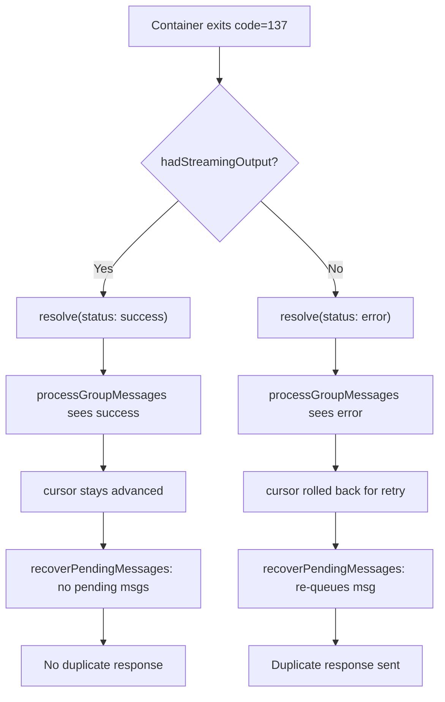

<!-- 93eb40f1-3faa-4b67-a2bb-51518d8d6ab3 -->
---
todos:
  - id: "fix-container-runner"
    content: "In container-runner.ts, add early-success path when code !== 0 but hadStreamingOutput is true (before the existing error block around line 533)"
    status: pending
isProject: false
---
# Fix Telegram Multiple Responses

## Root Cause (Confirmed from Logs)

Two distinct bugs combine to cause duplicate responses:

**Bug 1 — Container exits with code 137 after streaming output**

From `nanoclaw.log`:
```
Container exited with error  code: 137
Container agent error        error: "Container exited with code 137: ..."
Agent error after output was sent, skipping cursor rollback to prevent duplicates
```

Code 137 = SIGKILL (OOM or Apple Container forcibly killed). The container successfully streams its result, but then exits non-zero. `runContainerAgent` in `container-runner.ts` treats any non-zero exit as `status: 'error'` — even when output was already streamed.

The guard in `processGroupMessages` (`src/index.ts` lines 207–216) catches this and skips cursor rollback. So duplicates are prevented for the *first* crash. But the **second bug** causes duplicates anyway.

**Bug 2 — `recoverPendingMessages()` re-queues on restart**

The launchd plist has `KeepAlive: true`. When the process is restarted (SIGTERM seen in logs at 13:45:33 and 13:57:45), `recoverPendingMessages()` runs and checks `getMessagesSince(chatJid, lastAgentTimestamp[chatJid])`. 

The problem: `lastAgentTimestamp` is only advanced to the last *user* message timestamp. The bot's own reply is stored with `is_bot_message = 1` and filtered out of `getMessagesSince`. So after restart, the recovery sees the original user message as "unprocessed" (because `lastAgentTimestamp` wasn't advanced past it in the error path) and re-queues it — triggering a second agent run and a second response.

**Bug 3 — `hadStreamingOutput` variable hoisting (minor)**

In `container-runner.ts` line 354, `hadStreamingOutput = true` is set inside the `onOutput` streaming callback, but the variable is declared at line 393 — *after* the callback closure is created. In JavaScript `let` is not hoisted like `var`, so the assignment at line 354 references a variable that doesn't exist yet at the time the closure is created. This is a latent bug (the closure captures the binding, so it works at runtime, but the ordering is confusing and fragile).

## The Real Fix

The core issue is: **when a container exits with code 137 but already streamed output successfully, the cursor should be advanced, not left behind for recovery to re-process.**

### Fix in `src/container-runner.ts`

In the `container.on('close')` handler, when `code !== 0` but `hadStreamingOutput` is true (meaning the agent already sent its response), treat it as a success rather than an error:

```typescript
// Around line 533 in container-runner.ts
if (code !== 0) {
  // If we already streamed output, the agent completed its work.
  // Code 137 (SIGKILL) after output = container was killed after idle timeout
  // or OOM after completing — not a real failure.
  if (hadStreamingOutput) {
    outputChain.then(() => {
      logger.warn(
        { group: group.name, code, duration },
        'Container exited non-zero after streaming output (likely OOM/idle kill) — treating as success',
      );
      resolve({ status: 'success', result: null, newSessionId });
    });
    return;
  }
  // ... existing error path
}
```

This means `processGroupMessages` receives `status: 'success'`, the cursor stays advanced, and `recoverPendingMessages` on restart finds no unprocessed messages.

### Key Files

- `src/container-runner.ts` — lines ~533–552: add the `hadStreamingOutput` early-success path before the existing non-zero exit error block
- No changes needed to `src/index.ts`, `src/channels/telegram.ts`, or `src/db.ts`

## Flow After Fix


